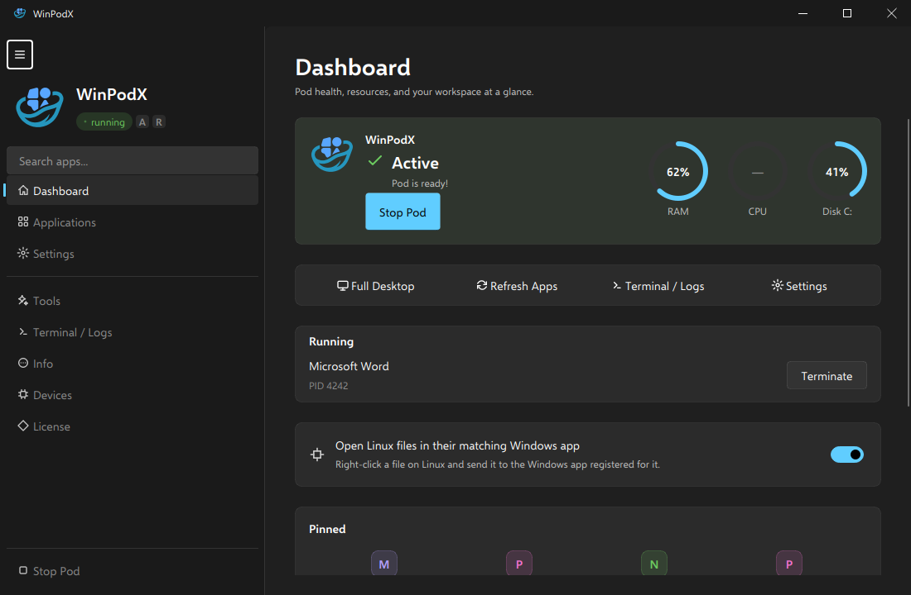

<div align="center">


### 앱을 클릭하면 Word가 열립니다. 그게 전부입니다.

<p>Windows 앱을 네이티브 Linux 창으로 — 실제 아이콘, 실제 <code>WM_CLASS</code>, 작업 표시줄 고정.<br>
dockur/windows 위에서 FreeRDP RemoteApp을 사용합니다. 상시 전체 화면 데스크톱도, 수동 설정도 없습니다.</p>

<pre><code># 설치 (최신 안정 릴리즈)
curl -fsSL https://raw.githubusercontent.com/kernalix7/winpodx/main/install.sh | bash

# 개발 브랜치 (불안정할 수 있음)
curl -fsSL https://raw.githubusercontent.com/kernalix7/winpodx/main/install.sh | bash -s -- --main

# 제거 (Windows VM은 유지, 전부 지우려면 --purge 추가)
curl -fsSL https://raw.githubusercontent.com/kernalix7/winpodx/main/uninstall.sh | bash -s -- --confirm</code></pre>

<a href="images/demo.png">
  
</a>

<sub>Windows 정보 / 작업 관리자 / PowerShell이 각각 별도의 Linux 창으로, WinPodX Dashboard와 나란히 떠 있습니다.</sub>

[](#상태-베타)
[](https://github.com/kernalix7/winpodx/releases)
[](https://github.com/kernalix7/winpodx/actions/workflows/ci.yml)
[](#테스트)

[](../LICENSE)
[](https://www.python.org/)

###### Works on

[](https://www.opensuse.org/)
[](https://fedoraproject.org/)
[](https://fedoraproject.org/atomic-desktops/)
[](https://www.debian.org/)
[](https://ubuntu.com/)
[](https://www.redhat.com/)
[](https://archlinux.org/)
[](INSTALL.ko.md#nix)
[](INSTALL.ko.md)

<sub>[English](../README.md) · **한국어** · [설치](INSTALL.ko.md) · [사용법](USAGE.ko.md) · [기능](FEATURES.ko.md) · [구조](ARCHITECTURE.ko.md) · [비교](COMPARISON.ko.md)</sub>

</div>

---

**목차:** [요구 사항](#요구-사항) · [설치](#설치) · [실행](#실행) · [데스크톱 앱](#데스크톱-앱) · [주요 기능](#주요-기능) · [문서](#문서) · [테스트](#테스트) · [기여](#기여-및-라이선스)

---

> ### 상태: 베타
>
> WinPodX는 활발히 개발 중이며 현재 버전은 **v0.11.0**입니다.
>
> - Windows 11 설정 앱 스타일 데스크톱 앱 — 반응형 탐색, 사용자 지정 창 장식, 데스크톱의 라이트/다크 설정을 따르는 테마
> - pod 상태, 리소스 사용량, 실행 중인 앱, 고정 앱을 한 화면에 모은 Dashboard
> - CLI와 GUI에서 dockur HTTP 프로비저닝 진행 상태를 우선 표시하고, 실패 시 로그로 대체
> - 간결한 시작 메뉴 스타일 플라이아웃이 된 `winpodx launch`와 새로 고친 트레이 실행기
> - 최소 Python 버전이 3.10으로 상향
>
> 전체 변경 내역은 [CHANGELOG](CHANGELOG.ko.md)에 있습니다.

## 제공하는 기능

각 Windows 앱이 자기 아이콘과 작업 표시줄 항목, 파일 연결을 그대로 가진 별도의 Linux 창으로 열립니다. 클립보드, 오디오, 프린터, 홈 디렉터리는 양방향으로 공유됩니다. 전체 Windows 데스크톱은 `winpodx app run desktop`으로 직접 요청할 때만 나타납니다.

WinPodX는 백그라운드 컨테이너에서 Windows를 실행하고 필요할 때 깨웁니다 — 유휴 상태에서는 pod가 일시 중지되고, 다음 실행 때 다시 시작됩니다.

## 요구 사항

Windows가 부팅되려면 가상화가 준비돼 있어야 합니다. 아래 세 가지가 "설치는 됐는데 Windows가 안 뜬다"는 사례의 대부분을 걸러냅니다:

| 요구 사항 | 확인 | 해결 |
|---|---|---|
| Intel VT-x 또는 AMD-V 활성화 | `lscpu \| grep -i virtualization` | 펌웨어에서 Intel Virtualization Technology, SVM Mode, VT-x를 켭니다. |
| KVM 모듈 로드 | `lsmod \| grep kvm` | `sudo modprobe kvm_intel` 또는 `sudo modprobe kvm_amd`. |
| 사용자의 KVM 접근 권한 | `id -nG \| tr ' ' '\n' \| grep kvm` | `sudo usermod -aG kvm $USER` 실행 후 로그아웃했다가 다시 로그인합니다. |

**하드웨어:** 가상화 확장을 지원하는 x86_64 또는 aarch64 CPU, RAM 8 GB 이상(12 GB 권장), 기본 64 GB Windows 디스크와 설치 ISO를 담을 여유 공간.

**소프트웨어:** FreeRDP 3+ 와 compose 제공자를 갖춘 Podman, 또는 Docker. 루트리스 Podman은 `/etc/subuid`와 `/etc/subgid` 항목도 필요합니다. `winpodx setup-host`를 실행하면 그룹과 subuid 설정을 한 번의 인증으로 처리하고, `winpodx doctor`로 언제든 남은 문제를 확인할 수 있습니다.

## 설치

상단의 curl 한 줄 명령은 지원하는 모든 배포판에서 동작하며 설정까지 마쳐 줍니다. 네이티브 패키지도 제공합니다:

```bash
# openSUSE Tumbleweed / Leap / Slowroll
sudo zypper addrepo https://download.opensuse.org/repositories/home:/Kernalix7/openSUSE_Tumbleweed/home:Kernalix7.repo
sudo zypper install winpodx

# Fedora 42 / 43 / 44 (dnf5 — Fedora 41+)
sudo dnf config-manager addrepo --from-repofile=https://download.opensuse.org/repositories/home:/Kernalix7/Fedora_43/home:Kernalix7.repo
sudo dnf install winpodx

# Debian / Ubuntu — 최신 릴리즈에서 맞는 .deb 내려받아
sudo apt install ./winpodx_<version>_all_debian13.deb

# AlmaLinux / Rocky / RHEL 9 / 10 — 최신 릴리즈에서 맞는 .rpm
sudo dnf install ./winpodx-<version>-0.noarch.el10.rpm

# Arch
yay -S winpodx

# Nix
nix run github:kernalix7/winpodx

# AppImage — 파일 하나로 모든 x86_64 배포판에서
chmod +x winpodx-x86_64.AppImage
./winpodx-x86_64.AppImage setup
```

**패키지·AppImage·소스·wheel로 설치했다면 setup을 한 번 실행하세요.** 패키지 설치는 의도적으로 바이너리만 담기 때문에, `apt install`만으로 긴 Windows 다운로드가 시작되지 않습니다:

```bash
winpodx setup              # 호스트 자동 감지 기본값, 질문 없음
winpodx setup --customize  # 백엔드, 코어, RAM, 에디션, 언어, 시간대, 디블로트 선택
```

setup은 설정을 작성하고 호스트를 점검한 뒤 Windows를 프로비저닝하고, 앱을 찾아 데스크톱 항목까지 등록합니다.

**업데이트:** curl로 설치했다면 같은 설치 명령을 다시 실행하면 설정과 VM을 유지한 채 제자리에서 갱신됩니다(Bazzite 등 rpm-ostree 호스트에서도 그대로 동작합니다). 패키지와 AppImage 설치는 설치할 때 쓴 방법으로 업데이트하세요.

RHEL 9, AlmaLinux 9, Rocky Linux 9의 기본 `python3`는 WinPodX가 지원하는 최소 버전보다 낮습니다. el9 패키지가 AppStream의 Python 3.11 스택을 자동으로 함께 설치합니다.

오프라인·에어갭 설치, 소스 빌드, Nix, 완전 제거는 [INSTALL.ko.md](INSTALL.ko.md)에 정리돼 있습니다.

## 실행

```bash
winpodx app run word              # Word 실행
winpodx app run word ~/doc.docx   # 파일 열기
winpodx app run desktop           # 전체 Windows 데스크톱
winpodx launch                    # 검색 가능한 시작 메뉴 스타일 앱 선택기
winpodx gui                       # 데스크톱 앱
```

또는 애플리케이션 메뉴에서 Windows 앱을 그냥 클릭하면 됩니다 — WinPodX가 찾아낸 앱마다 실제 데스크톱 항목을 만들어 둡니다. `winpodx launch`를 사용자 지정 단축키에 연결하면(KDE: *시스템 설정 → 단축키*, GNOME: *설정 → 키보드*) 시스템 전역 핫키로 쓸 수 있습니다.

## 데스크톱 앱

<a href="images/gui-dashboard.png">
  
</a>

`winpodx gui`는 Windows 11 설정 앱 스타일의 셸을 여덟 페이지로 제공합니다:

| 페이지 | 내용 |
|---|---|
| **Dashboard** | pod 상태와 Start/Stop, RAM · CPU · 디스크 링, 빠른 작업, 실행 중인 세션, 고정 앱 |
| **Applications** | 검색, 카테고리별 개수, 그리드/리스트 전환, 앱별 동작을 갖춘 시작 메뉴 타일 |
| **Settings** | 연결, 하드웨어, Windows Update, 통합, 언어를 목적별로 묶고 저장 전까지 변경 표시 |
| **Tools** | pod와 게스트 작업 — 일시 중지, 재개, 디스크 확장, 디블로트, 수정 적용 |
| **Terminal** | pod와 앱 로그, 허용된 명령만 실행하는 명령 바 |
| **Info** | 버전, 상태 점검, 클릭 한 번으로 복사하는 진단 정보 |
| **Devices** | 버스별로 묶은 USB · PCI 패스스루, 위험한 할당은 표시 |
| **License** | 라이선스 전문과 서드파티 고지 |

탐색 페인은 평상시 320 px이고 창이 1100 px보다 좁아지면 48 px 아이콘 레일로 접히며, 이때 햄버거 버튼을 누르면 콘텐츠 위에 겹쳐서 펼쳐집니다. 테마는 데스크톱의 라이트/다크 설정을 따릅니다. `WINPODX_COLOR_SCHEME=light|dark`로 강제하거나, `WINPODX_NATIVE_TITLEBAR=1`로 내장 타이틀바 대신 창 관리자 장식을 쓸 수 있습니다. 나머지는 [GUI 둘러보기](USAGE.ko.md#qt6-gui-둘러보기)를 참고하세요.

## 주요 기능

| 영역 | 내용 |
|---|---|
| **매끄러운 앱 실행** | RemoteApp이 실제 아이콘, `WM_CLASS`, 작업 표시줄 통합, 파일 연결, 다중 모니터, 최대 50개의 동시 RDP 세션을 갖춘 네이티브 창으로 앱을 엽니다. |
| **앱 찾기** | 시작 메뉴에 보이는 Win32와 UWP 앱을 아이콘과 함께 가져옵니다. `winpodx app refresh` 또는 Applications에서 다시 검색합니다. |
| **공유** | 양방향 클립보드, 오디오, 프린터, `\\tsclient\home`, 이동식 미디어, USB · PCI 패스스루. |
| **Reverse-open** | Linux 앱이 Windows **연결 프로그램** 메뉴에 나타나고, 제어된 리스너를 통해 호스트에서 파일을 받습니다. |
| **Pod 운영** | 기본 Podman에 Docker와 수동 RDP 지원. 유휴 시 자동 일시 중지, 멈춘 게스트 복구, 비밀번호 교체, Windows 디스크 확장. |
| **개인정보 및 조정** | 선택적 Windows 디블로트, 호스트 적응형 KVM 조정, DPI 감지, FreeRDP 플래그 허용 목록, 시간 동기화, 선택적 베어메탈 위장. |
| **언어** | CLI, 트레이, 데스크톱 앱을 영어, 한국어, 중국어, 일본어, 독일어, 프랑스어, 이탈리아어로 제공합니다. |

## 문서

| 문서 | 내용 |
|---|---|
| [INSTALL.ko.md](INSTALL.ko.md) | 모든 설치 방법, 업데이트, 오프라인, 소스, Nix, 제거 |
| [USAGE.ko.md](USAGE.ko.md) | CLI 레퍼런스, GUI 둘러보기, 상태 점검, 설정 |
| [FEATURES.ko.md](FEATURES.ko.md) | RemoteApp, reverse-open, 주변기기, 앱 찾기, 패스스루 |
| [ARCHITECTURE.ko.md](ARCHITECTURE.ko.md) | 시스템 다이어그램, 소스 트리, 데이터 흐름 |
| [COMPARISON.ko.md](COMPARISON.ko.md) | winapps · LinOffice · winboat · Wine과의 비교 |
| [CHANGELOG.ko.md](CHANGELOG.ko.md) | 버전 기록 |
| [CONTRIBUTING.ko.md](CONTRIBUTING.ko.md) | 개발 환경 설정과 기여 절차 |
| [SECURITY.ko.md](SECURITY.ko.md) | 보안 제보 절차 |

## 테스트

```bash
export PYTHONPATH="$PWD/src"
python3 -m pytest tests/ -n auto     # 4000개 이상, 병렬로 수 초
ruff check src/ tests/
ruff format --check src/ tests/
```

## 기여 및 라이선스

변경을 보내기 전에 [CONTRIBUTING.ko.md](CONTRIBUTING.ko.md)를 읽어 주세요. 보안 제보는 [SECURITY.ko.md](SECURITY.ko.md)를 따릅니다. WinPodX는 [MIT 라이선스](../LICENSE)이며 저작자는 Kim DaeHyun입니다.

## Star History

<a href="https://github.com/kernalix7/winpodx/tree/star-history">
  <picture>
    <source media="(prefers-color-scheme: dark)" srcset="https://raw.githubusercontent.com/kernalix7/winpodx/star-history/chart-dark.svg" />
    <source media="(prefers-color-scheme: light)" srcset="https://raw.githubusercontent.com/kernalix7/winpodx/star-history/chart.svg" />
    
  </picture>
</a>

## 후원 / Support

WinPodX가 여러분의 Linux 데스크톱을 조금 더 낫게 만들었다면:

[](https://github.com/sponsors/kernalix7)
[](https://ko-fi.com/kernalix7)
[](https://fairy.hada.io/@kernalix7)

GitHub Sponsors는 정기·일회성 후원을, Ko-fi는 해외 카드와 PayPal을, fairy.hada.io는 국내 후원을 지원합니다. 버그 리포트와 PR, 스타도 똑같이 반갑습니다 — 그리고 무료입니다.
